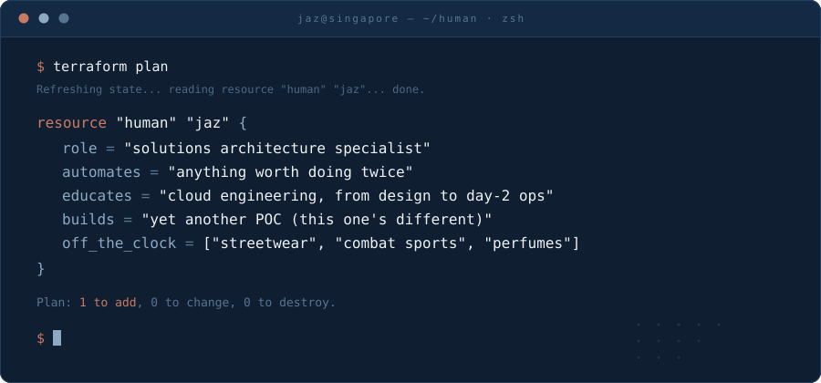

  

 

**now** — Solutions Architecture Specialist. Infrastructure automation is the through-line: helping teams codify, provision, and run their platforms so infrastructure isn't something they think about at 2am.

**teaching** — Cloud engineering education for working professionals: system design, cloud architecture, Terraform, Kubernetes — and the practices around them, from SRE to platform engineering to DevOps. Taught with real clusters, real bills, real breakage.

**tinkering** — permanently in POC mode. If I do it twice, I automate it. OpenShift on EC2 · Terraform builds on AWS · live meeting translation · cohort dashboards · invoice generation that runs itself. Nothing ever reaches "production" — that's the point.

**off the clock** — streetwear, combat sports, and a perfume rotation longer than any Terraform state file I've ever planned against.

 

  <code>terraform apply</code> · no badges, by design

